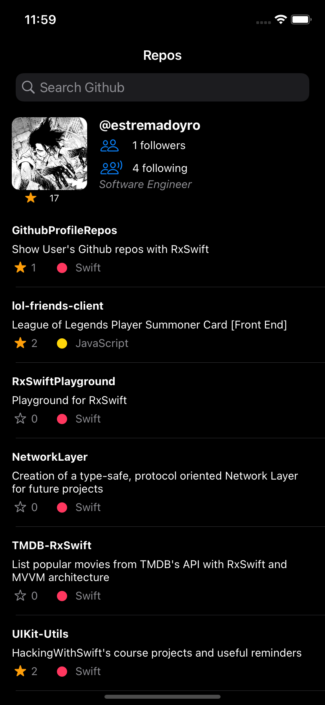

# Github Profile Repos
Small app trying to recreate the Github's repos section from the iOS app with RxSwift and .nibs. This project is currently in progress. Feel free to fork & make a PR if interested in contributing.

### Considerations
You will more likely exceed the Github's API rate limit for your IP, so there is a mocking layer (could use some aditional improvements) for simulating API calls with .json files inside the *Mocks* folder.\
If you are looking to mock a call you only need to change the **mock** flag inside the HOmeViewModel.swift file.
```swift
func getReposFromUsername(username: String) -> Observable<[Repo]> {
    return Observable.create { observer in
      // mocking: true -> Mocks an API call by reading its respective .json instead
      // mocking : false (Or parameter omited) -> Makes network API calls
      self.networkManager.getReposByUsername(username: username, mocking: true, completion: { repos, error in
        if let error = error {
          observer.onError(error)
        }
        if let repos = repos {
          observer.onNext(repos)
        }
        observer.onCompleted()
      })
      return Disposables.create()
    }
  }

```

### Keys.swift
Stores a GithubApiKey, it is not currently necessary as it's not pointing endpoints which require to. However, the file is needed inside the Bundle for the project to compile.
```swift
struct Keys {
  // Could be empty "", as mentioned
  static let githubApiKey: String = "YOUR_GITHUB_API_KEY"
}
```

### Screenshots
#### Home
| Light | Dark | 
| --- | --- | 
|  |  |

### Todo
Small Todo's yet to complete, will be filling out periodically. PR's are welcome.  
- [x]  Passing observable to the RepoCell in a clean manner
- [x]  Create mock for requests
- [ ]  Create cache for requets (API called each time a cell gets reused
- [x]  Probably fix the LanguagesLabel in each cell, it’s not showing the correct languages per repo due to cell reusing.
- [x]  Test subscribe() vs. bind()
- [x]  Make Description Label wrap up to 2 lines, it’s currently going 1 line nonstop
- [x]  Automatic cell height
- [x]  Fix getMostUsedLanguage
- [x]  Center vertically the UIStackView inside the UIView (within the Cell)
- [x]  Structure RepoCell.nib properly (with container view in TableView VC? with child view controllers?, plain view inside the TableVC, additional MVVM layer for it? The latter seems the most likely, with 2 child VC and 1 master VC for the whole screen
- [ ]  User UIView height should be 20% of superview on smaller devices, but 120 on bigger
- [ ]  Create Network Requests for the User's Followers, Following & Avatar
- [ ]  Calculate total lines of code
- [ ]  Get total stars awarded
